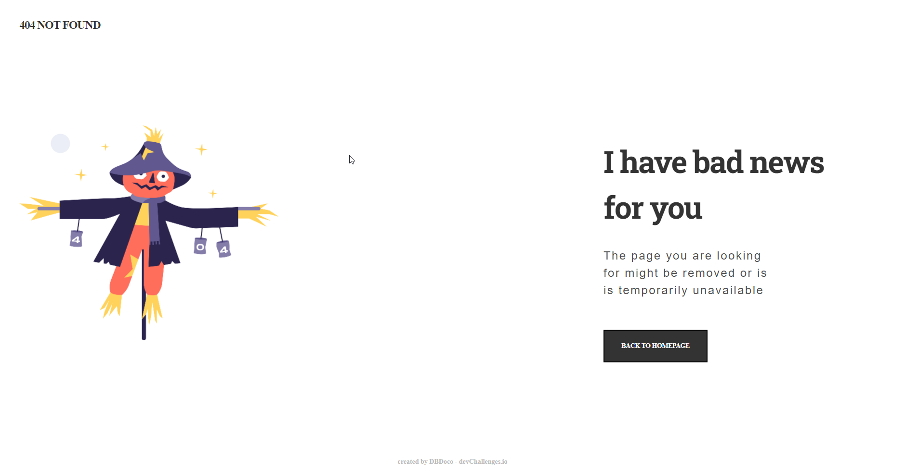

<h1 align="center">404 page - devChallenges.io</h1>

   Solution for a challenge from  <a href="http://devchallenges.io" target="_blank">Devchallenges.io</a>.

  <h3>
    <a href="https://639b2fc8a8f0b92361bd6f3f--sensational-queijadas-606de6.netlify.app">
      Demo
    </a>
     | 
    <a href="https://devchallenges.io/solutions/85bcweN7Bl89ZiS49p4k">
      Solution
    </a>
     | 
    <a href="https://devchallenges.io/challenges/wBunSb7FPrIepJZAg0sY">
      Challenge
    </a>
  </h3>

<!-- TABLE OF CONTENTS -->

## Table of Contents

- [Overview](#overview)
- [Features](#features)

<!-- OVERVIEW -->

## Overview

## Features

This application/site was created as a submission to a [DevChallenges](https://devchallenges.io/challenges) challenge. The [challenge](https://devchallenges.io/challenges/wBunSb7FPrIepJZAg0sY) was to build an application to complete the given user stories.

